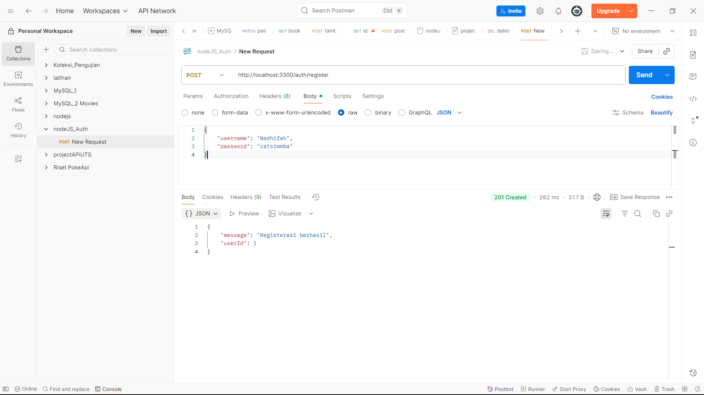
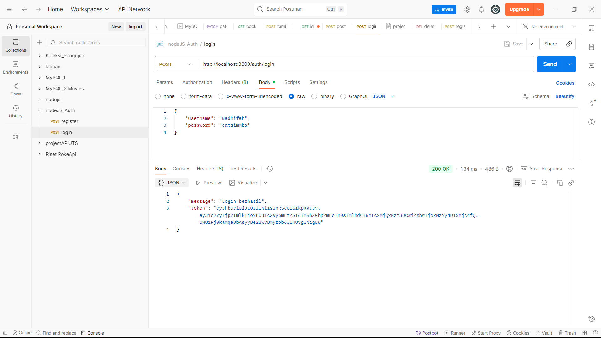
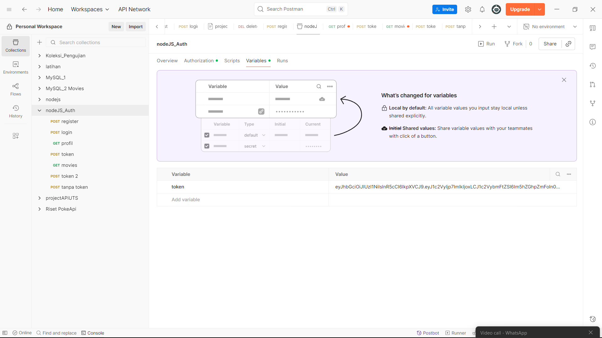
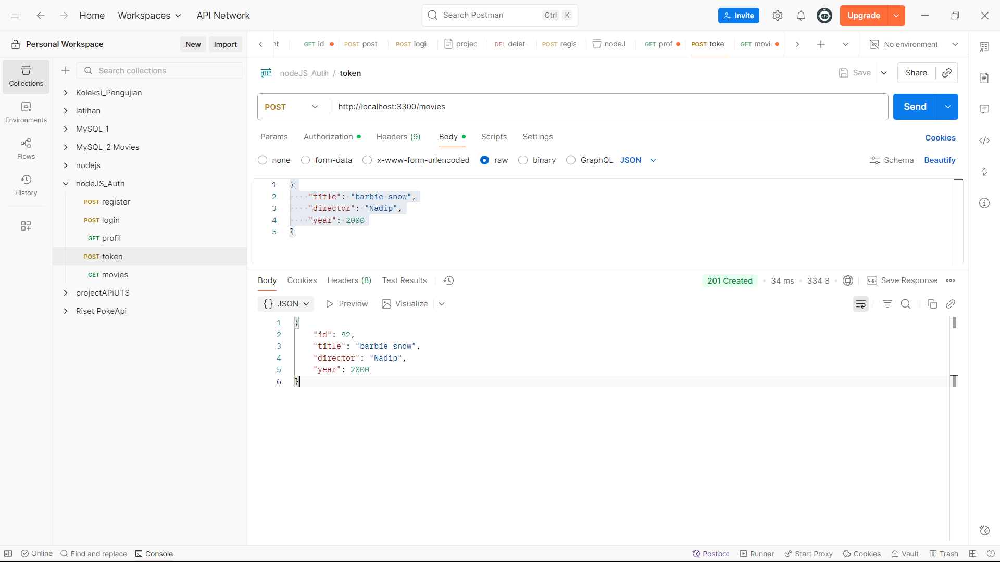

### Nama  : Nadhifah Afiyah Qurota'ain
### NIM   : 362458302100
### Kelas : 2D TRPL

## Tujuan Tugas
*mengimplementasikan middleware autentikasi pada serangkaian endpoint baru*
*memperkuat pemahaman tentang alur kerja autentikasi berbasis token*

## Skenario
mengamankan semua endpoint yang bersifat tulis atau memodifikasi data untuk sumber daya **/movies** dan **/directors** yang telah dibuat, sehinggan hanya pengguna yang sudah login yang dapat menggunakan-nya

## Langkah langkah Praktikum

1. mendowload **npm install bcryptjs** di terminal vsc
2. pada file **.env** menambahkan variabel baru yaitu *JWT_SECRET="GANTI_DENGAN_KUNCI_RAHASIA_YANG_SANGAT_KUAT_DAN_UNIK"*
3. Kemudian memodifikasi di file database.js dengan menambahkan tabel user didalam movies setelah tabel movies.
4. mengimplementasikan endpoint registrasi yaitu yang pertama mengimpor **bcryptjs** dan muat **JWT_SECRET**
5. kemudian menambahkan route baru untuk register dan juga login. ditambahkan setelah **get status**
6. membuat Middleware Autentikasi yaitu yang pertama membuat folder dengan nama **middleware** kemudian di dalam folder tersebut membuat file bernama **authMiddleware.js**
7. menerapkan perlindungan pada route film dengan mengimpor middleware di file server.js. kemudian menambahkan **authenticateToken** pada route *post/put/delete movies* dan juga *post/put/delete directors*

## Pengujian

1. menjalankan menggunakan nodemon server.js kemudian diakses menggunakan postman
2. menjalankan register, dengan menggunakan post yaitu untuk menambahkan data baru
    
3. menjalankan login, dengan menginputkan data yg sudah dibuat di register
    
4. mensalin token kemudian kita klik nama collection itu, pilih **authorization** kemudian pilih **Bearer Token** 
    
5. setelah itu klik yang variabel, terus masukkan nama variabel nya dan juga salin token yg udh di dapat dari login trus di tempel dibagian value
    
6. mencoba menambahkan data dengan metode **post**
    
7. pesan yang keluar jika token sudah kadaluwarsa
    
8. pesan jika token tidak diinputkan
    
9. mencoba melakukan put(mengganti isi data sesuai dengan id) pada movies
    
10. mencoba melakukan delete(menghapus data sesuai dengan id) pada movies
    
11. menambahkan data (post) pada directors
    
12. mengubah data (put) sesuai dengan id pada directors
    
13. menghapus data (delete) sesuai dengan id pada directors
    

## Kesimpulan
dengan menerapkan autentikasi berbasis JWT, API yang sebelumnya terbuka kini memiliki lapisan keamanan yang kuat. hanya pengguna terverifikasi yang dapat melakukan operasi penting seperti menambah, mengubah, ataupun menghapus data. Praktikum ini memberikan pemahaman dasar pengamanan API yang sangat penting dalam pengembangan aplikasi web modern.

## Postman
    [text](postman/nodeJS_Auth.postman_collection.json)